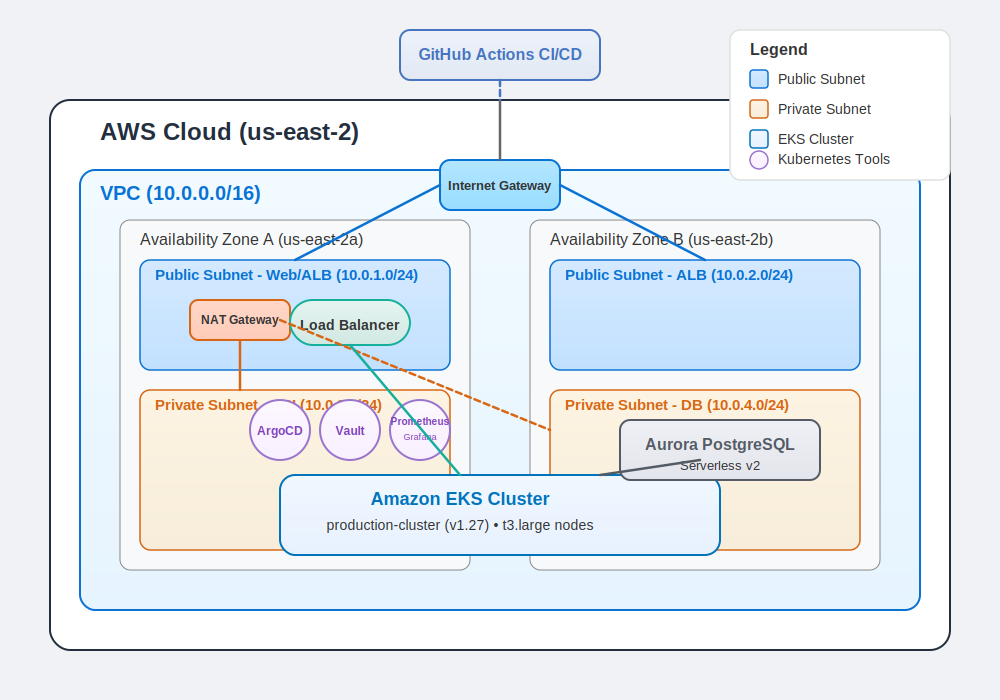

# Terraform AWS Infrastructure

## Overview
This repository delivers an AWS infrastructure orchestrated with Terraform, featuring a three-tier architecture. It utilizes Amazon EKS for compute, Aurora PostgreSQL for data persistence, and a secure networking layer, all managed via GitOps with ArgoCD. Automated CI/CD pipelines, powered by GitHub Actions, ensure seamless deployment and maintenance of infrastructure and applications. This pet project explores scalability, security, and infrastructure-as-code practices in a comprehensive cloud environment.

## Architecture Diagram



## Architecture
The project implements a three-tier architecture optimized for resilience and scalability:

- **Networking Tier**: A VPC with public and private subnets across multiple availability zones, reinforced with route tables and security groups for high availability and isolation.
- **Compute Tier**: An Amazon EKS cluster with managed node groups, integrated with AWS load balancing and IAM for a robust Kubernetes environment.
- **Database Tier**: An Aurora PostgreSQL cluster with serverless scaling, deployed in private subnets for secure and scalable data management.

Additional components enhance functionality:

- **CI/CD**: GitHub Actions automates deployments for continuous integration and delivery.
- **GitOps**: ArgoCD provides declarative Kubernetes management for version-controlled, auditable deployments.
- **Monitoring**: Prometheus, Grafana, Loki, and Falco deliver comprehensive observability of system performance and security.

## Repository Structure
The repository is organized for modularity and maintainability:

```
.
├── .github/workflows      # GitHub Actions workflows for CI/CD pipelines
├── apps                   # Source code for sample API and Web applications
├── helm/charts            # Helm charts for Kubernetes deployments
├── k8s/argocd             # ArgoCD manifests for GitOps workflows
├── modules                # Modular Terraform configurations
│   ├── eks                # EKS cluster and node group setup
│   ├── rds                # Aurora PostgreSQL database configuration
│   ├── tools              # Kubernetes tools (e.g., monitoring, logging)
│   └── vpc                # VPC and networking resources
├── root                   # Root Terraform configuration tying modules together
└── scripts                # Utility scripts for automation tasks
```

This structure promotes separation of concerns, easing updates and scaling.

## Infrastructure Components

### VPC & Networking
- Multi-AZ VPC with public and private subnets for high availability.
- NAT Gateway for secure outbound traffic from private subnets.
- Internet Gateway for public subnet connectivity.
- Route tables and security groups enforcing network isolation and least-privilege access.
- Deployed in the **us-east-2** region across multiple availability zones.

### Kubernetes (EKS)
- Managed EKS cluster with optimized node groups for efficient workloads.
- CSI drivers for dynamic persistent storage provisioning.
- IAM roles with least-privilege access for secure AWS integrations.
- AWS Load Balancer Controller for scalable and reliable ingress traffic management.

### Database (RDS)
- Aurora PostgreSQL with serverless scaling to adapt to workload demands.
- Hosted in private subnets with automated backups and maintenance for data durability.
- Security groups restricting access to authorized services only.

### GitOps Components
- **ArgoCD**: Facilitates continuous delivery of Kubernetes applications via GitOps.
  - Employs sync waves to manage deployment order and dependencies.
  - Application manifests located in k8s/argocd.
- **Helm**: Packages Kubernetes resources for consistent, repeatable deployments.
- **Vault**: Secures sensitive data with dynamic secrets and Kubernetes integration, providing secure database credentials to the API application.

### Monitoring Stack
- **Prometheus**: Collects metrics from infrastructure and applications.
- **Grafana**: Visualizes metrics and logs with customizable dashboards.
- **Loki**: Centralizes logs for streamlined analysis.
- **Promtail**: Forwards logs to Loki for processing.
- **Falco**: Monitors runtime security, alerting on suspicious activities.

## Deployment Workflow

### Infrastructure Deployment (Terraform)
- **Networking**: Provisions VPC, subnets, gateways, and security groups.
- **Compute**: Deploys the EKS cluster with managed node groups.
- **Database**: Configures the Aurora PostgreSQL cluster in private subnets.
- **Tools**: Installs Kubernetes tools via Helm charts.

Terraform deploys these components modularly, with state stored in an S3 bucket ("ofurmaniuk" at "terraform-project/terraform.tfstate") for persistence and collaboration.

### Application Deployment (GitOps)
- CI pipelines build and containerize applications.
- ArgoCD synchronizes deployments to EKS based on Git changes.
- Vault secures runtime secrets.
- Ingress controllers route external traffic to applications.

## CI/CD Pipelines

- **Infrastructure Pipeline**: 
  - Automates Terraform validation, planning, and application
  - Implements staged deployment (VPC → EKS → Node Groups → RDS → Tools)
  - Includes verification steps and health checks between critical components
  - Triggers on changes to Terraform files or via manual workflow dispatch

- **Application Pipelines**: 
  - Runs ESLint for code quality and SonarCloud for static analysis
  - Builds and publishes Docker images to DockerHub with versioned tags
  - Performs Trivy vulnerability scanning on container images
  - Handles both API (Node.js/Express) and Web frontend applications

- **Deployment Pipelines**: 
  - Leverages ArgoCD for GitOps-based deployment with sync waves
  - Follows specific sequence: CSI Driver → Monitoring → Ingress → Metrics Server → Vault → Applications
  - Logs detailed deployment information for auditing and troubleshooting
  - Enables continuous synchronization between Git and the Kubernetes cluster

These pipelines minimize manual effort while ensuring consistent, repeatable deployments across the entire infrastructure.

## Prerequisites
To use this project, ensure you have:

- An AWS account with permissions for VPC, EKS, RDS, and related resources.
- Terraform (v1.0.0 or higher).
- kubectl for Kubernetes interaction.
- Helm for managing Kubernetes packages.
- Docker for building application images.
- A GitHub account with GitHub Actions enabled.

Note: Specify exact versions if compatibility is critical.

## Applications
Two sample applications showcase the infrastructure:

- **API Application**: A Node.js Express API integrated with Aurora PostgreSQL, demonstrating database connectivity.
- **Web Application**: A frontend app interacting with the API, illustrating full-stack deployment.

Both are containerized, deployed via Helm, and managed through GitOps.

## Operations

### Infrastructure Scaling
- Modify Terraform variables to resize resources (e.g., EKS node groups).
- Aurora PostgreSQL scales automatically with serverless configuration.
- EKS supports node group auto-scaling based on demand.
- Kubernetes HPA dynamically adjusts pod replicas.

### Maintenance
- **Secret Rotation**: Use Vault to periodically rotate database credentials and secrets.
- **Upgrades**:
  - Update EKS versions via Terraform module changes.
  - Manage AWS resource updates (e.g., RDS engine) through Terraform.
  - Upgrade applications and tools by updating Helm chart versions.

## Acknowledgments
This project builds on exceptional tools and platforms:

- Terraform by HashiCorp
- Amazon Web Services (AWS)
- Kubernetes
- ArgoCD for GitOps excellence
- Helm
- Vault by HashiCorp